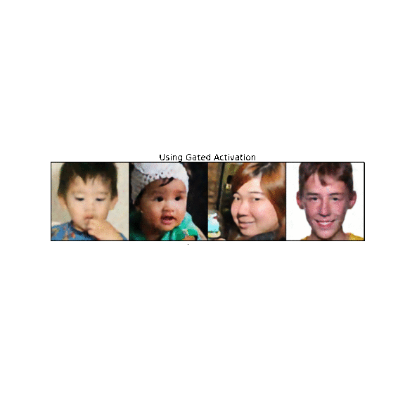

# Image-Inpaint-Denoise-Deblur-Pytorch

This model is capable of performing good quality image inpainting, denoising and debluring simultaneously in time efficient manner. 
 
 
I have used convolutional decoder for image generation but the activation employed is Gated_Activation as proposed in the paper <a href="https://arxiv.org/abs/1606.05328"> Conditional Image Generation with PixelCNN Decoders</a>.

I have also tested an equivalent decoder with Relu activation(Samples Below) and yes the Gated_Activation produces superior results.

# Methedology
# Dataset

